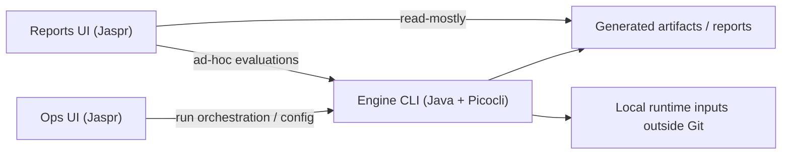

# Go No-Go Architecture

## Goal

Keep the decision engine CLI as the source of truth while allowing lightweight browser UIs to visualize outputs and orchestrate runs without absorbing core evaluation logic.

## Repository Stack

- `services/engine`: Java 21 + Gradle + Picocli
- `services/engine/ops-ui`: Jaspr + Dart
- `apps/reports-ui`: Jaspr + Dart

## System Boundaries

## Current Shape

- The engine owns configuration, evaluation logic, output artifacts, and the primary execution flow.
- `ops-ui` is an operations-facing companion to the engine and remains under engine ownership.
- `reports-ui` is a read-mostly consumer of engine-generated artifacts and delegates ad-hoc evaluation back to the engine instead of reimplementing decision logic.
- The public repository is read-only by default; local runtime data such as real candidate profiles and CVs stay outside Git.

## Guardrail Intent

- Keep the engine CLI authoritative for logic and artifacts.
- Keep both UIs thin and explicit.
- Expose only the minimum browser-safe metadata needed for local workflows; keep private runtime files, filesystem paths, and debug details server-side.
- Treat repository-level verification as a combination of root contract checks plus stack-specific validation for the engine and both Jaspr apps.

## Verification Strategy

Run `./scripts/verify.sh` for root or cross-project work. Child projects remain responsible for their own deeper behavior-specific documentation.
