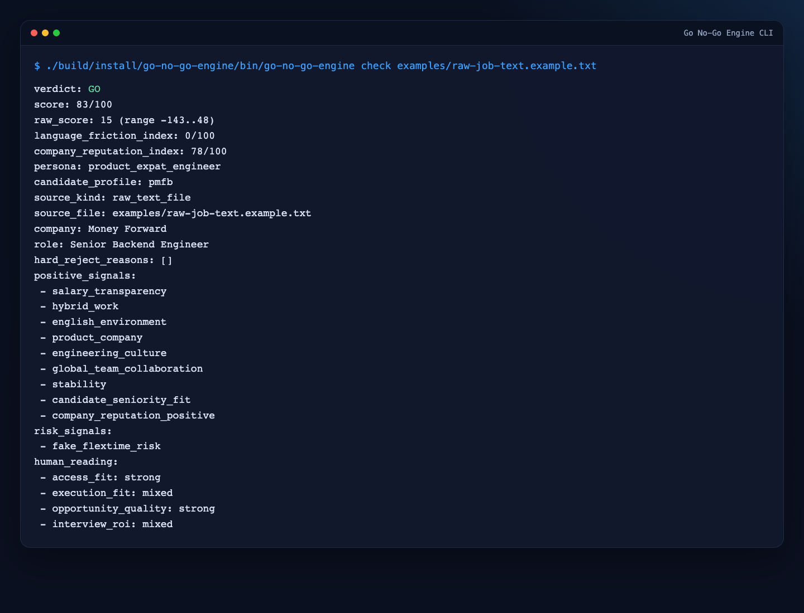
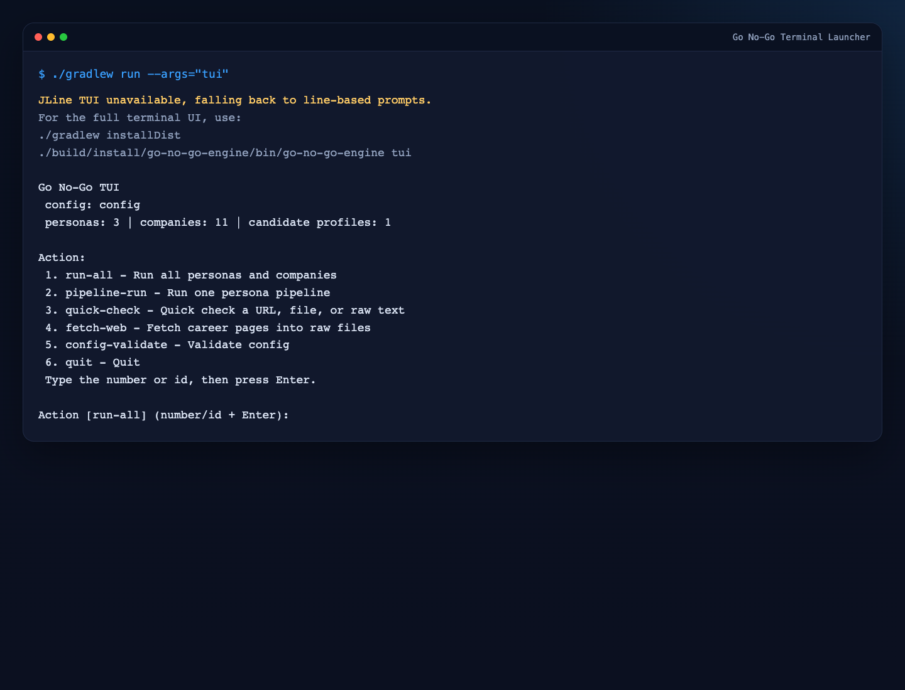
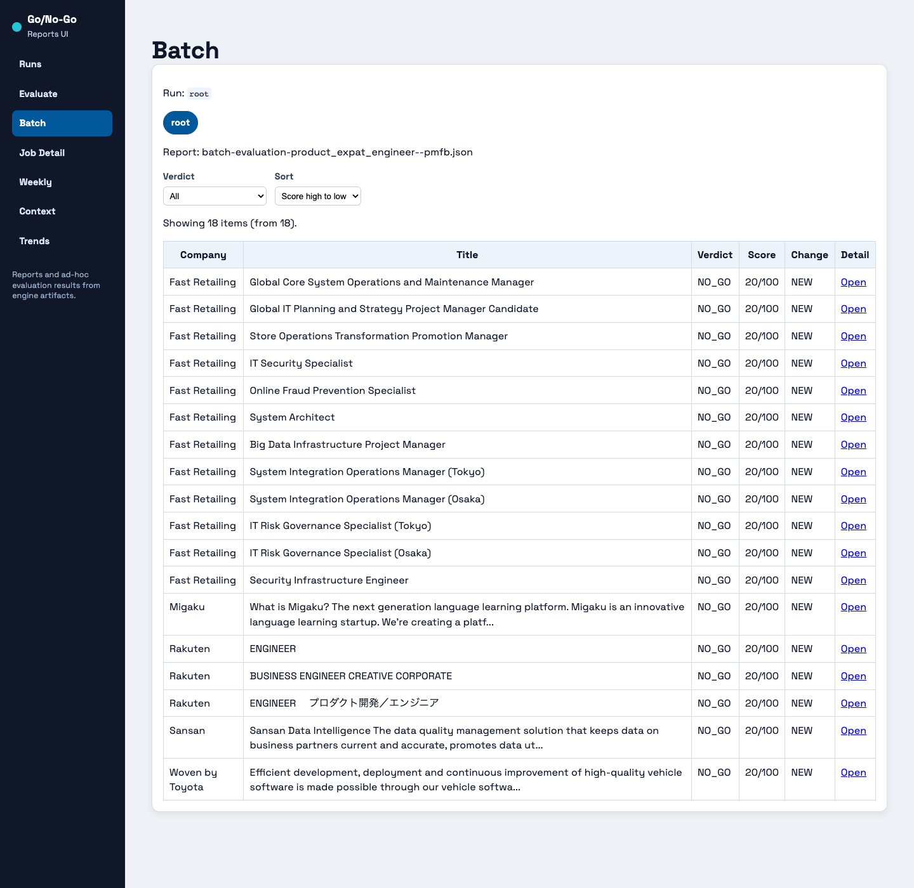

# Go No-Go

Monorepo for the Go No-Go system.

The engine remains the source of truth. The browser UIs are companion layers for operations and report consumption, not replacements for the CLI contracts.

## Stack

- `services/engine`: Java 25 + Gradle + Picocli
- `services/engine/ops-ui`: Jaspr + Dart
- `apps/reports-ui`: Jaspr + Dart

## Repository Map

- `services/engine`: core engine and CLI-driven workflows
- `services/engine/ops-ui`: visual configuration UI owned by the engine
- `apps/reports-ui`: reporting UI plus ad-hoc job evaluation delegated to the engine

## Prerequisites

- Java 25 available on your `PATH`
- Dart SDK installed
- `jaspr_cli` installed for local UI development

## Quick Start

Engine CLI and terminal launcher:

```bash
cd services/engine
./gradlew installDist
./build/install/go-no-go-engine/bin/go-no-go-engine check examples/raw-job-text.example.txt
./build/install/go-no-go-engine/bin/go-no-go-engine tui
```

Operations UI:

```bash
cd services/engine/ops-ui
dart pub get
jaspr serve --port 8791 --web-port 5467 --proxy-port 5567
```

Reports UI:

```bash
cd apps/reports-ui
dart pub get
jaspr serve --port 8792 --web-port 5468 --proxy-port 5568
```

Project-specific documentation:

- `services/engine/README.md`
- `services/engine/ops-ui/README.md`
- `apps/reports-ui/README.md`
- `docs/README.md`

## Screenshots

CLI sample evaluation:



Terminal launcher:



Operations UI:


Reports UI batch view:



## Local UI Ports

- `services/engine/ops-ui`: `http://localhost:8791` by default
- `apps/reports-ui`: `http://localhost:8792` by default

When running both Jaspr UIs at the same time, the HTTP ports are not enough by themselves.
`jaspr serve` also uses internal dev ports:

- `--web-port`: default `5467`
- `--proxy-port`: default `5567`

Recommended local dev commands:

```bash
cd services/engine/ops-ui
jaspr serve --port 8791 --web-port 5467 --proxy-port 5567
```

```bash
cd apps/reports-ui
jaspr serve --port 8792 --web-port 5468 --proxy-port 5568
```

## Working Agreements

- Cross-project repository rules live in `AGENTS.md` at the repository root.
- Pull requests for this repository use the root `.github/PULL_REQUEST_TEMPLATE.md`.
- Child project documentation remains inside each imported project directory when present.

## Verification Entry Point

```bash
./scripts/verify.sh
```

## Migration Note

This repository was created by importing the previous standalone engine and reports UI repositories into a single parent repository while preserving history.
