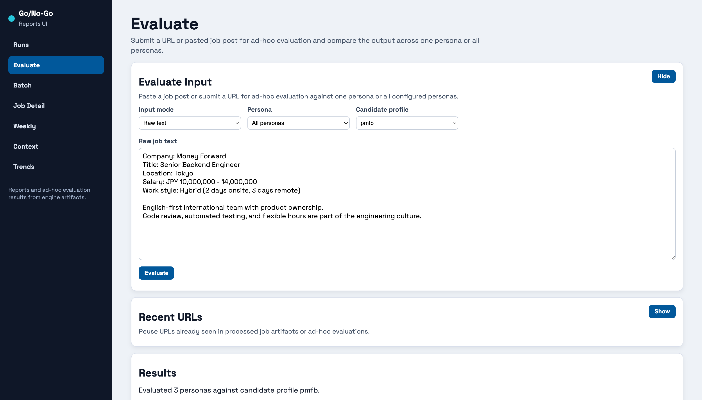
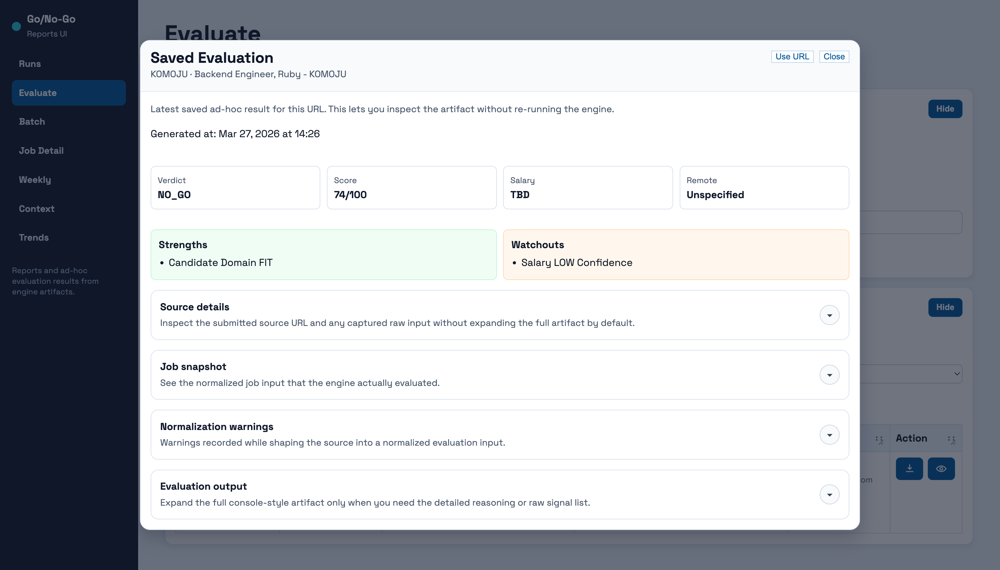

# Go/No-Go Reports UI

Browser UI for reading engine artifacts and running ad-hoc checks through the engine without moving scoring logic into the browser.

Stack: Jaspr and Dart.

## What It Is For

This app is the read-mostly front end for the repository. It turns engine output into faster human workflows: scan a run, open one evaluated job, compare ad-hoc results across personas, and revisit saved evaluations without exposing local runtime details in the browser.

## Main Areas

- `Runs`: discover available report sets and jump into the generated views.
- `Evaluate`: submit a URL or pasted job text, compare results across one persona or all personas, and reuse recent URLs.
- `Batch`: scan verdicts and scores across one report run.
- `Job Detail`: inspect one evaluated job with reasoning, signals, verdict, and score.
- `Weekly`, `Context`, and `Trends`: read digest, company context, and trend artifacts generated by the engine.

## Data Flow

- Reads the configured reports root, usually `services/engine/output`.
- Stores ad-hoc evaluation artifacts under `ad-hoc-evaluations/`.
- Delegates evaluation back to the engine instead of implementing scoring logic locally.
- Keeps filesystem paths and internal runtime details server-side.

## Start Here

- Repository quickstart: [`../../docs/quickstart.md`](../../docs/quickstart.md)
- Advanced guide: [`../../docs/advanced-guide.md`](../../docs/advanced-guide.md)

Run from the repository root:

```bash
./scripts/run-reports-ui.sh
```

Default local URL:

- `http://localhost:8792`

Build output:

```bash
jaspr build
```

The helper script already sets `REPORTS_ROOT`, `ENGINE_ROOT`, and dedicated Jaspr ports so this app can run beside `ops-ui`.
The server binds to loopback by default. Set `REPORTS_UI_BIND_HOST=0.0.0.0` only when you intentionally need LAN exposure.

## Screens

### Evaluate Workspace



### Saved Evaluation Modal



### Batch Report


## Notes

- The UI is English-only and public-facing by default.
- Candidate profiles are shown by stable id only.
- The browser never becomes the source of truth for engine logic or artifacts.
