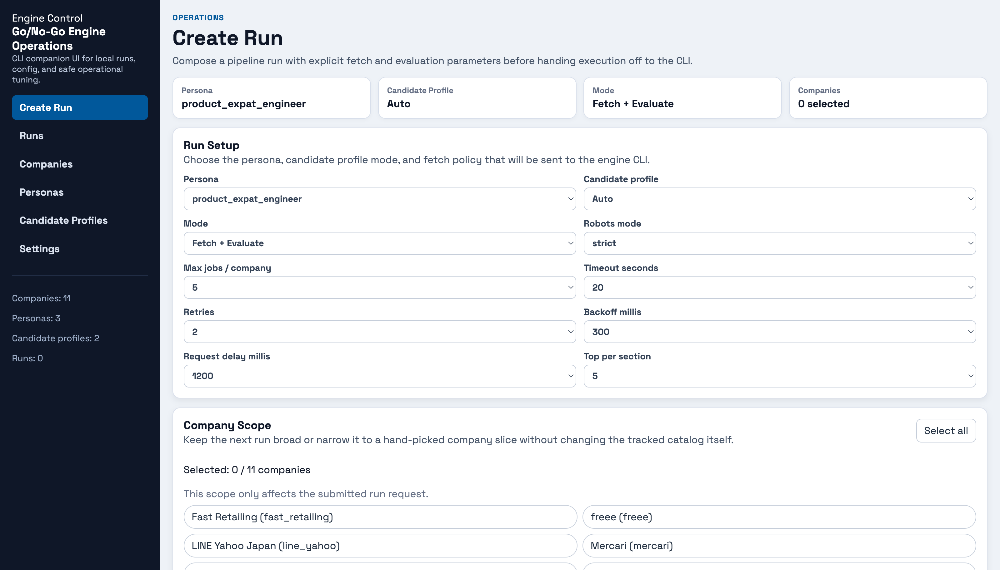

# Go/No-Go Engine Operations UI

Browser UI for operating the CLI pipeline from the same repository.

This app is intentionally lightweight and CLI-first:

- Keeps `go-no-go-engine` as the execution source of truth.
- Lets you configure and trigger runs from a form.
- Shows run status and sanitized request summaries.



## Features (MVP)

- Load personas, candidate profiles, and company list from `../config`.
- Create pipeline runs with controlled parameters.
- Choose runtime candidate-profile mode for each run (`Auto`, `None`, or explicit profile id).
- Queue runs and execute them one at a time.
- Track run status: `queued`, `running`, `succeeded`, `failed`.
- Inspect run request settings and lifecycle timestamps in the browser.
- Create personas with salary-floor support and tune existing persona weights/strategy.
- Browse candidate profile ids without exposing YAML content or personal fields.

## Privacy posture

- Candidate profiles are local runtime inputs; the browser UI only exposes stable ids.
- Filesystem paths, shell commands, and live execution logs stay server-side.
- Internal server errors return sanitized messages instead of raw exception text.

## Runtime defaults

- Default port: `8791`
- Default engine root: parent folder (`..`)
- Default command: `./gradlew run --args="pipeline run ..."`

Prerequisites:

- Dart SDK installed
- `jaspr_cli` available on your `PATH`

## Quick Start

From the monorepo root:

```bash
./scripts/run-ops-ui.sh
```

The root helper script:

- starts from the monorepo root
- `cd`s into `services/engine/ops-ui`
- pins `--web-port 5467` and `--proxy-port 5567`
- sets `ENGINE_ROOT` to the engine project by default

Open:

- `http://localhost:8791`

This default is intentionally different from `apps/reports-ui` so both Jaspr UIs can run at the same time.

## Optional env vars

- `OPS_UI_PORT`: override the Operations UI port explicitly.
- `OPS_UI_WEB_PORT`: override the internal Jaspr webdev port.
- `OPS_UI_PROXY_PORT`: override the internal Jaspr proxy port.
- `ENGINE_ROOT`: override engine repository path.
- `ENGINE_GRADLEW`: override gradle wrapper command path.

## Running Alongside `reports-ui`

If `apps/reports-ui` is also running, keep distinct Jaspr dev ports for each app.

Recommended split:

- `ops-ui`: `./scripts/run-ops-ui.sh`
- `reports-ui`: `./scripts/run-reports-ui.sh`

If you see `Address already in use` on `5467` or `5567`, the conflict is in Jaspr's internal dev servers, not in the final app URL.

## Responsive UI

The UI includes responsive behavior for desktop and mobile:

- single-column form on small screens
- horizontal overflow handling for runs table
- stacked actions and compact panel spacing on narrow devices
